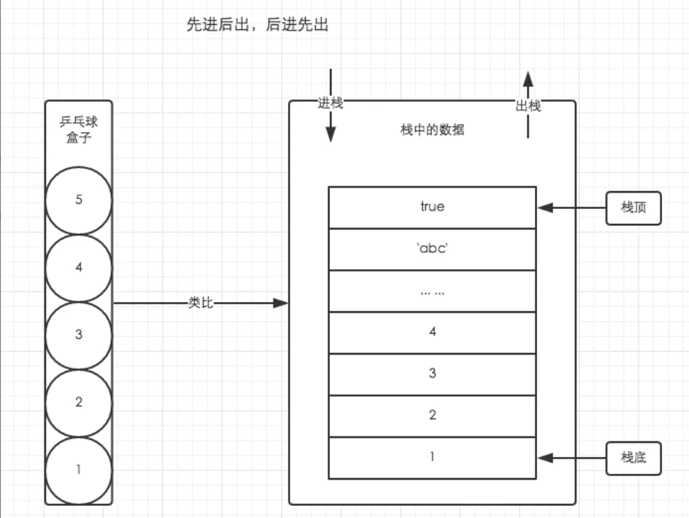
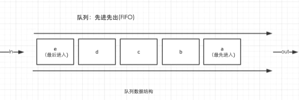

## 一、堆
堆数据结构是一种树状结构。它的存取数据的方式与书架与书非常相似
好比在JSON格式的数据中，我们存储的key-value是可以无序的，因为顺序的
不同并不影响我们的使用，我们只需要关心书的名字。

## 二、栈

JavaScript中并没有严格意义上区分栈内存与堆内存。
因此我们可以简单粗暴的理解为JavaScript的所有数据都
保存在堆内存中。但是在某些场景，我们仍然需要基于栈数据
结构的思维来实现一些功能，比如JavaScript的执行上下文
执行上下文的执行顺序借用了栈数据结构的存取方式

#### 特点：先进后出，后进先出

## 三、队列
队列是一种先进先出（FIFO）的数据结构。正如排队过安检一样，排在队伍前面的人一
定是最先过检的人。用以下的图示可以清楚的理解队列的原理。

## 四、池

常量池

## 五、变量的存放
1、基本类型 --> 保存在栈内存中，因为这些类型在内存中分别占有固定大小的空间，通过按值来访问。基本类型一共有7种：
Undefined、Null、Boolean、Number 、String、Symbol、bigInt

2、引用类型 --> 保存在堆内存中，因为这种值的大小不固定，因此不能把它们保存到栈内存中，但内存地址大小的固定的，因此
保存在堆内存中，在栈内存中存放的只是该对象的访问地址。当查询引用类型的变量时， 先从栈中读取内存地址， 然后再通过地址
找到堆中的值。对于这种，我们把它叫做按引用访问。

在计算机的数据结构中，栈比堆的运算速度快，Object是一个复杂的结构且可以扩展：数组可扩充，对象可添加属性，都可以增删改查。
将他们放在堆中是为了不影响栈的效率。而是通过引用的方式查找到堆中的实际对象再进行操作。所以查找引用类型值的时候先去栈查找
再去堆查找。

### 六、内存空间管理

因为JavaScript具有自动垃圾收集机制，所以我们在开发时好像不用关心内存的使用问
题，内存的分配与回收都完全实现了自动管理。但是根据以往的开发经验，了解内存机
制有助于自己清晰的认识到自己写的代码在执行过程中发生过什么，从而写出性能更加
优秀的代码。

关心内存是一件非常重要的事情。

JavaScript的内存生命周期

* 分配你所需要的内存
* 使用分配到的内存（读、写）
* 不需要时将其释放、归还

JavaScript有自动垃圾收集机制，最常用的是通过标记清除的算法来找到哪些对象是不再继续使用的，使用a = null其实仅仅只是做了一个
释放引用的操作，让 a 原本对应的值失去引用，脱离执行环境，这个值会在下一次垃圾收集器执行操作时被找到并释放。

在局部作用域中，当函数执行完毕，局部变量也就没有存在的必要了，因此垃圾收集器很容易做出判断并回收。但是全局变量什么时候需要自动
释放内存空间则很难判断，因此在开发中，需要尽量避免使用全局变量。

