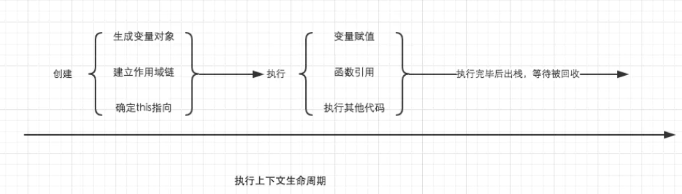

## 一、概念
执行上下文是当前 JavaScript 代码被解析和执行时所在环境的抽象概念。

### 类型

每次当控制器转到可执行代码的时候，就会进入一个执行上下文。执行上下文可以理解为当前代码的执行环境，它会形成一个作用域。JavaScript中的运行环境大概包括三种情况。

* 全局上下文：只有一个，浏览器中的全局对象就是 window 对象，this 指向这个全局对象。

* 函数执行上下文：存在无数个，只有在函数被调用创建，每次调用函数都会创建一个新的执行上下文

* eval函数执行上下文：一般不考虑


### 执行栈

 执行栈，也叫调用栈，具有 LIFO（后进先出）结构，用于存储在代码执行期间创建的所有执行上下文。   

首次运行JS代码时，会创建一个全局执行上下文并Push到当前的执行栈中。每当发生函数调用，引擎都会为该函数创建一个新的函数执行上下文并Push到当前执行栈的栈顶。

根据执行栈LIFO规则，当栈顶函数运行完成后，其对应的函数执行上下文将会从执行栈中Pop出，上下文控制权将移到当前执行栈的下一个执行上下文。


```
 var a = 'Hello World!';
 
 function first() {  
   console.log('Inside first function');  
   second();  
   console.log('Again inside first function');  
 }
 
 function second() {  
   console.log('Inside second function');  
 }
 
 first();  
 console.log('Inside Global Execution Context');


```


### 执行上下文的创建
* 创建阶段
  * 在这个阶段中，执行上下文会分别创建变量对象，建立作用域链，以及确定this指向
* 执行阶段
  * 创建完成之后，就会开始执行代码，会完成变量赋值，函数引用，以及执行其他代码。




### 创建阶段
在这个阶段中，执行上下文会分别创建变量对象，建立作用域链，以及确定this指向。
```$xslt
ExecutionContext = {  
  ThisBinding = <this value>,     // 确定this 
  LexicalEnvironment = { ... },   // 词法环境(作用域)
  VariableEnvironment = { ... },  // 变量环境(变量对象)
}
```
### 结论

* 单线程
* 同步执行，只有栈顶的上下文处于执行中，其他上下文需要等待
* 全局上下文只有唯一的一个，它在浏览器关闭时出栈
* 函数的执行上下文的个数没有限制
* 每次某个函数被调用，就会有个新的执行上下文为其创建，即使是调用的自身函数，也是如此。


### 思考

《JavaScript权威指南》中的例子：
```
var scope = "global scope";
function checkscope(){
    var scope = "local scope";
    function f(){
        return scope;
    }
    return f();
}
checkscope();


var scope = "global scope";
function checkscope(){
    var scope = "local scope";
    function f(){
        return scope;
    }
    return f;
}
checkscope()();

```


#### 解析
都会输出 'local scope'

两段代码执行的结果一样，但是两段代码究竟有哪些不同呢？

答案就是执行上下文栈的变化不一样。

```
第一段
ECStack.push(<checkscope> functionContext);
ECStack.push(<f> functionContext);
ECStack.pop();
ECStack.pop();

第二段

ECStack.push(<checkscope> functionContext);
ECStack.pop();
ECStack.push(<f> functionContext);
ECStack.pop();

```
