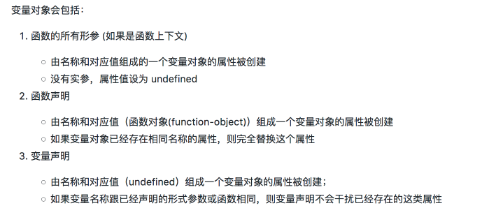
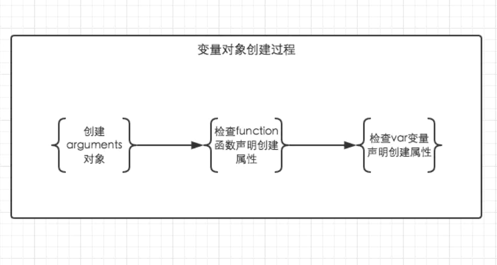

## 变量对象
JS是单线程的语言，执行顺序肯定是顺序执行，但是JS 引擎并不是一行一行地分析和执行程序，而是一段一段地分析执行，会先进行编译阶段然后才是执行阶段。



变量对象VO->活动对象AO
### 过程
* 全局上下文的变量对象初始化是全局对象
* 函数上下文的变量对象初始化只包括 Arguments 对象
* 在进入执行上下文时会给变量对象添加形参、函数声明、变量声明等初始的属性值
    * 建立arguments对象：检查当前上下文中的参数，建立该对象下的属性与
      属性值。
    * 检查当前上下文的函数声明，也就是使用function关键字声明的函数。在变量对象中以函数名建立一个属性，属性值为指向该函数所在内存地址的引用
    * 检查当前上下文中的变量声明，每找到一个变量声明，就在变量对象中以变量名建立一个属性，属性值为undefined
      如果变量与函数同名，则在这个阶段，以函数值为准
* 在代码执行阶段，会再次修改变量对象的属性值
  
  


function声明优先级大于var


```$xslt
function test() {
    console.log(foo);
    console.log(bar);

    var foo = 'Hello';
    console.log(foo);
    var bar = function () {
        return 'world';
    }

    function foo() {
        return 'hello';
    }
}

test();

// 创建阶段
VO = {
    arguments: {...},
    foo: <foo reference>,
    bar: undefined
}
// 这里有一个需要注意的地方，var声明的变量与函数同名，以函数为准


// 执行阶段
VO -> AO
VO = {
    arguments: {...},
    foo: 'Hello',
    bar: <bar reference>,
    this: Window
}
```

```$xslt
// 以浏览器中为例，全局对象为window
// 全局上下文
windowEC = {
    VO: Window,
    scopeChain: {},
    this: Window
}
```


### 变量提升

概念：变量提升实际上很容易理解，就是说在任何位置所声明的变量或函数，都会自动“提”到最前面，就好像它们是在函数的开头声明的一样

例1：变量提升
```$xslt
foo;  // undefined
var foo = function () {
    console.log('foo1');
}

foo();  // foo1，foo赋值

var foo = function () {
    console.log('foo2');
}

foo(); // foo2，foo重新赋值
```


````$xslt

//1.基本
console.log(a);
var a = 1;// 输出 undefined

//2.使用 var 来声明变量的时候，会提到当前作用域的顶端，而赋值操作在原处不变

var a;
console.log(a); //输出 1
a = 1;

//3.多个script的情况
<script>
console.log(a)
</script>
<script>
var a = 1;
</script><br data-filtered="filtered">//ReferenceError: a is not defined

//4.不用var直接赋值
console.log(a);  //ReferenceError: a is not defined
a = 1;

//5. if 不通过，还是提升了
console.log(a) // undifined
if(false){
  var a = 1;
}

````
例2：函数提升

```$xslt
foo();  // foo2
function foo() {
    console.log('foo1');
}

foo();  // foo2

function foo() {
    console.log('foo2');
}

foo(); // foo2
```
例3：声明优先级，函数 > 变量

```$xslt
foo();  // foo2
var foo = function() {
    console.log('foo1');
}

foo();  // foo1，foo重新赋值

function foo() {
    console.log('foo2');
}

foo(); // foo1
```

结论：
* var存在变量提升，多个同名会被最后的覆盖
* function存在函数提升，多个同名会被最后的覆盖
* 对于同名的变量和函数，只会提升函数而不会提升变量


### 为什么进行变量提升
首先我们要知道，JS在拿到一个变量或者一个函数的时候，会有两步操作，即解析和执行。

在解析阶段，JS会检查语法，并对函数进行预编译。解析的时候会先创建一个全局执行上下文环境，先把代码中即将执行的变量、函数声明都拿出来，变量先赋值为undefined，函数先声明好可使用。在一个函数执行之前，也会创建一个函数执行上下文环境，跟全局执行上下文类似，不过函数执行上下文会多出this、arguments和函数的参数。

全局上下文：变量定义，函数声明
函数上下文：变量定义，函数声明，this，arguments
在执行阶段，就是按照代码的顺序依次执行。

那为什么会进行变量提升呢？主要有以下两个原因：

* 提高性能
  * 在JS代码执行之前，会进行语法检查和预编译，并且这一操作只进行一次。这么做就是为了提高性能，如果没有这一步，那么每次执行代码前都必须重新解析一遍该变量（函数），而这是没有必要的，因为变量（函数）的代码并不会改变，解析一遍就够了。
    
    在解析的过程中，还会为函数生成预编译代码。在预编译时，会统计声明了哪些变量、创建了哪些函数，并对函数的代码进行压缩，去除注释、不必要的空白等。这样做的好处就是每次执行函数时都可以直接为该函数分配栈空间（不需要再解析一遍去获取代码中声明了哪些变量，创建了哪些函数），并且因为代码压缩的原因，代码执行也更快了。
* 容错性更好
  *  变量提升可以在一定程度上提高JS的容错性
  ```
  a = 1;
  var a;
  console.log(a); 
  //如果没有变量提升，这两行代码就会报错，但是因为有了变量提升，这段代码就可以正常执行。
  ```

##### 总结
* 解析和预编译过程中的声明提升可以提高性能，让函数可以在执行时预先为变量分配栈空间
* 声明提升还可以提高JS代码的容错性，使一些不规范的代码也可以正常执行

##### 变量提升导致的问题

变量提升虽然有一些优点，但是他也会造成一定的问题，在ES6中提出了let、const来定义变量，它们就没有变量提升的机制。

下面来看一下变量提升可能会导致的问题：
在这个函数中，原本是要打印出外层的tmp变量，但是因为变量提升的问题，内层定义的tmp被提到函数内部的最顶部，相当于覆盖了外层的tmp，所以打印结果为undefined
````$xslt
var tmp = new Date();

function fn(){
	console.log(tmp);
	if(false){
		var tmp = 'hello world';
	}
}

fn();  // undefined
````
由于遍历时定义的i会变量提升成为一个全局变量，在函数结束之后不会被销毁，所以打印出来11。
```$xslt
var tmp = 'hello world';

for (var i = 0; i < tmp.length; i++) {
	console.log(tmp[i]);
}

console.log(i); // 11
```


### let和var
* let是块级作用域，var是函数作用域
* let暂时性死区，不存在变量提升，var存在变量提升
* let不能重复声明，var可以


### 参考
* [执行上下文栈](https://www.muyiy.cn/blog/1/1.2.html#%E6%89%A7%E8%A1%8C%E4%B8%8A%E4%B8%8B%E6%96%87%E6%A0%88)
* [变量对象详解](https://www.jianshu.com/p/330b1505e41d)
* [JS为什么要进行变量提升](https://blog.csdn.net/qq_42033567/article/details/108225059)
