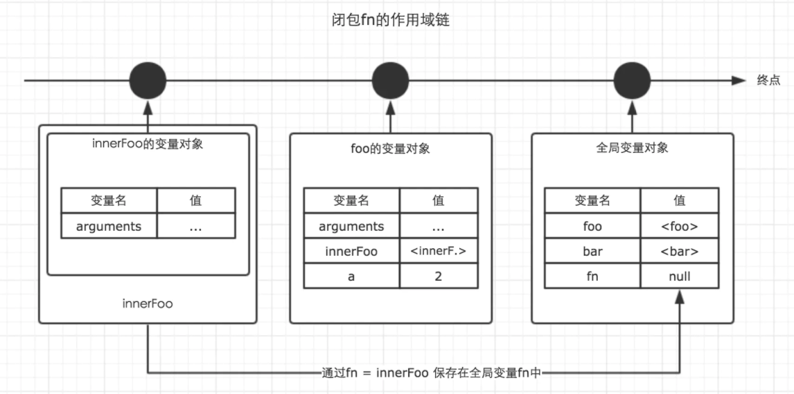
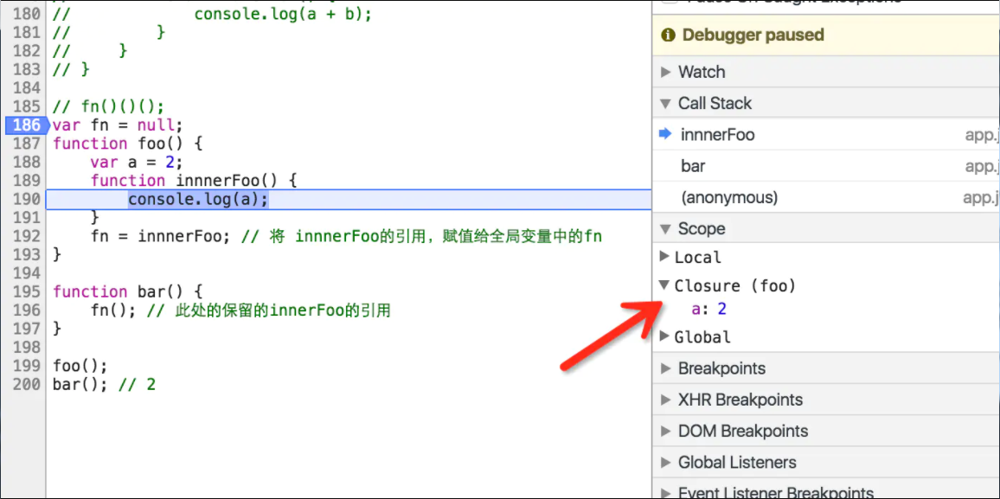

### 概念

* 红皮书：闭包是指有权访问另外一个函数作用域中的变量的函数
  闭包 = 函数 + 函数能够访问的自由变量
* 闭包是一种特殊的对象。
它由两部分组成。执行上下文(代号A)，以及在该执行上下文中创建的函数（代号B）。
当B执行时，如果访问了A中变量对象中的值，那么闭包就会产生。
在大多数理解中，包括许多著名的书籍，文章里都以函数B的名字代指这里生成的闭包。而在chrome中，则以执行上下文A的函数名代指闭包。

JavaScript拥有自动的垃圾回收机制，关于垃圾回收机制，有一个重要的行为，那就是，当一个值，在内存中失去引用时，垃圾回收机制会根
据特殊的算法找到它，并将其回收，释放内存。
而我们知道，函数的执行上下文，在执行完毕之后，生命周期结束，那么该函数的执行上下文就会失去引用。其占用的内存空间很快就会被垃圾
回收器释放。可是闭包的存在，会阻止这一过程。


例：
```
var fn = null;
function foo() {
  var a = 2;
  function innnerFoo() {
    console.log(a);
  }
  fn = innnerFoo; // 将 innnerFoo的引用，赋值给全局变量中的fn
}

function bar() {
  fn(); // 此处的保留的innerFoo的引用
}

foo();
bar(); // 2

```
* 1.进入全局代码，创建全局执行上下文，全局执行上下文压入执行上下文栈
* 2.全局执行上下文初始化
* 3.执行 foo 函数，创建 foo 函数执行上下文，foo 执行上下文被压入执行上下文栈
* 4.将foo函数中innnerFoo赋值给全局变量中的fn，foo函数出栈
* 5.执行 bar 函数，创建 bar 函数执行上下文，bar 执行上下文被压入执行上下文栈
* 6.执行bar函数中fn， fn执行上下文被压入执行上下文栈
* 7.fn 执行上下文初始化，创建变量对象、作用域链、this等
* 8.fn访问到foo中的a值为2，fn 函数上下文从执行上下文栈中弹出
* 9.bar出栈



浏览器中观察




当fn函数执行的时候，foo 函数上下文已经被销毁了啊(即从执行上下文栈中被弹出)，怎么还会读取到 foo 作用域下的 scope 值呢？

当我们了解了具体的执行过程后，我们知道 fn 执行上下文维护了一个作用域链：

fnContext = {
    Scope: [AO,fooScopeContext.AO, globalContext.VO],
}

实践角度：
* 即使创建它的上下文已经销毁，它仍然存在（比如，内部函数从父函数中返回）
* 在代码中引用了自由变量

### 应用场景
* 高阶函数
  * 柯里化
  * 模块化
  
  
  
### 思考

```
for (var i = 1; i <= 5; i++) {
  setTimeout(function timer() {
    console.log(i);
  }, i * 1000);
}

结果：每个一秒输出6 共五次

全局
globalContext = {
    VO: {
        timer()
        i: 5
    }
}

timerContext = {
    Scope: [AO, timerContext.AO globalContext.VO]
}

```


```
1.快速输出1,2,3,4,5
for (var i = 1; i <= 5; i++) {
  setTimeout(function timer() {
    console.log(i);
  }(i), i * 1000);
}

2.每个一秒依次输出1，2，3，4，5 自执行函数提供闭包条件，二是传入i值并保存在闭包中。
for (var i = 1; i <= 5; i++) {
  (function (i) {
    setTimeout(function timer() {
      console.log(i);
    }, i * 1000);
  })(i)
}

3.let块级作用域 每个一秒依次输出1，2，3，4，5 

for (let i = 1; i <= 5; i++) {
  setTimeout(function timer() {
    console.log(i);
  }, i * 1000);
}


4.在setTimeout的第一个参数处利用闭包。 每个一秒依次输出1，2，3，4，5 

for (var i = 1; i <= 5; i++) {
  setTimeout((
  function timer(i) {
      return function(){
      console.log(i);
      }
    }
  )(i), i * 1000);
}

5.settimeout第三个参数 每个一秒依次输出1，2，3，4，5

for (let i = 1; i <= 5; i++) {
  setTimeout(function timer(i) {
    console.log(i);
  }, i * 1000,i);
}

6.bind 每个一秒依次输出1，2，3，4，5

for (var i=1; i<=5; i++) {
setTimeout( function timer(i) {
console.log(i);
}.bind(null,i), i*1000 );
}
```
