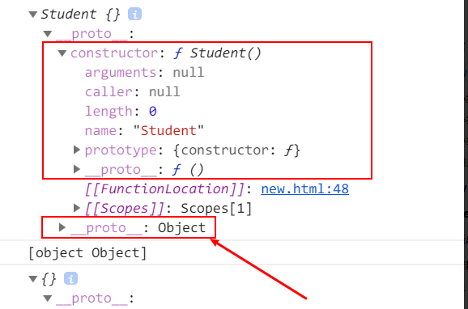

## new做了什么

### 例子1
```
function Student(){
}
var student = new Student();
console.log(student); // {}
// student 是一个对象。
console.log(Object.prototype.toString.call(student)); // [object Object]
// 我们知道平时声明对象也可以用new Object(); 只是看起来更复杂
// 顺便提一下 `new Object`(不推荐)和Object()也是一样的效果
// 可以猜测内部做了一次判断，用new调用
/** if (!(this instanceof Object)) {
* return new Object();
* }
*/
var obj = new Object();
console.log(obj) // {}
console.log(Object.prototype.toString.call(student)); // [object Object]

typeof Student === 'function' // true
typeof Object === 'function' // true


```


student.constructor === Student;

Student.prototype.constructor === Student;

由例子1可知：
* 1.创建了一个全新的对象
* 2.这个对象会被执行[[Prototype]]（也就是__proto__）链接。

### 例子2
```

// 例子2
function Student(name){
    console.log('赋值前-this', this); // {}
    this.name = name;
    console.log('赋值后-this', this); // {name: 'AA'}
}
var student = new Student('AA');
console.log(student); // {name: 'AA'}
```
Student函数中的this指向new Student()生成的对象student。
由例子2可知：
* 1.生成的新对象会绑定到函数调用的this


例子：
```angular2


// 例子4
function Student(name){
    this.name = name;
    // Null（空） null
    // Undefined（未定义） undefined
    // Number（数字） 1
    // String（字符串）'1'
    // Boolean（布尔） true
    // Symbol（符号）（第六版新增） symbol
    
    // Object（对象） {}
        // Function（函数） function(){}
        // Array（数组） []
        // Date（日期） new Date()
        // RegExp（正则表达式）/a/
        // Error （错误） new Error() 
    // return /a/;
}
var student = new Student('AA');
console.log(student); {name: 'AA'}

```
前面六种基本类型都会正常返回{name: 'AA'}，

后面的Object(包含Functoin, Array, Date, RegExg, Error)都会直接返回这些值。

结论:
* 1.如果函数没有返回对象类型Object(包含Functoin, Array, Date, RegExg, Error)，那么new表达式中的函数调用会自动返回这个新的对象。

则，new过程做了这些事：
* 1.创建了一个全新的对象。
* 2.这个对象会被执行[[Prototype]]（也就是__proto__）链接。
* 3.生成的新对象会绑定到函数调用的thi
* 4.通过new创建的每个对象将最终被[[Prototype]]链接到这个函数的prototype对象上
* 5.如果函数没有返回对象类型Object(包含Functoin, Array, Date, RegExg, Error)，那么new表达式中的函数调用会自动返回这个新的对象。

### 模拟实现

```
function newCreate(){
  var obj=new Object();
  Con=[].shift.call(arguments);
  obj.__proto__=Con.prototype;
  var result=Con.apply(obj,arguments);
  return result instanceof Object?result:obj;
}


function newCreate(){
 Con=[].shift.call(arguments);
 var obj=Object.create(Con.prototype);
 var result=Con.apply(obj,arguments);
 return result instanceof Object?result:obj;
}


```


参考

[能否模拟实现JS的new操作符](https://juejin.cn/post/6844903704663949325#heading-2)

[new模拟实现](https://www.muyiy.cn/blog/3/3.5.html#模拟实现)