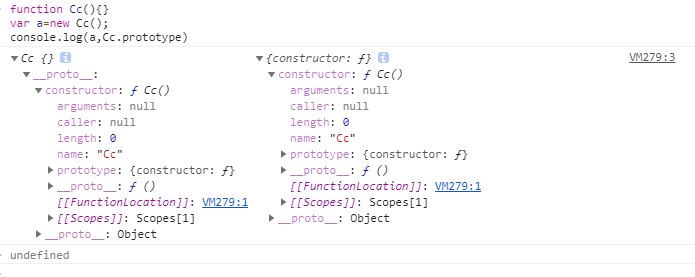
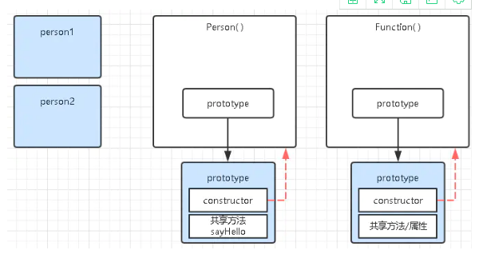

### 为什么容易理解混乱
* JS内函数即对象。
* Function对象和Object对象这两个内置对象的特殊性。(鸡与蛋)


### 深入理解原型对象
####  1.回顾构造函数
```

function Cc(){}
var c=new Cc();
console.log(c);               //__proto__
console.log(Cc.prototype)     //constructor(prototype,__proto__) __proto__

```


由图可知,理解该知识点主要为：prototype、constructor、__proto __

* prototype:对象的一个属性，是一个指针，指向对象原型，显式原型
* constructor:构造函数属性，指向prototype属性所在的函数
* [[Prototype]]:实例中包含的一个指针，指向构造函数的原型对象，没有标准方法访问
  * __ proto__:浏览器中用来访问[[Prototype]]，隐式原型

#### 2.深入理解

1. 函数即对象
```
function Person() {...}
console.log(Person.constructor) // 输出结果:[Function: Function]
// 上面是普通函数声明方法，生成具名函数，在声明时就已经生成对象模型。
console.log(Function.constructor) // 输出结果:[Function: Function]
console.log(Object.constructor) // 输出结果:[Function: Function]

```
对象由函数创建，函数都是Function对象实例。

2.constructor的作用

返回创建实例对象时构造函数的引用。此属性的值是对函数本身的引用，而不是一个包含函数名称的字符串。

实例对象.constructor=该实例对象的构造函数
```
function Parent(age) {
    this.age = age;
}

var p1 = new Parent(50);
var p2 = new Parent(50);
p1.constructor === Parent; // true
p1.constructor === Object; // false

console.log(p1.constructor) // 结果输出: [Function: Parent]

```

constructor的其他知识：

* 虽然是基本数据类型，但 Symbol(123) 实例可以获取 constructor 属性值。
* 对于引用类型来说 constructor 属性值是可以修改的，但是对于基本类型来说是只读的。

3.prototype是为何而出现

```
//接上例子
// 下面是给p1和p2实例添加了同一个效果的方法sayHello
p1.sayHello = function() {
    console.log('Hello!')
}
p2.sayHello = function() {
    console.log('Hello!')
}
console.log(p1.sayHello === p2.sayHello) // false

当需要为大量实例添加相同效果的方法时，可以将它们存放在prototype对象中，
并将该prototype对象放在这些实例的构造函数上，达到共享、公用的效果

Parent.prototype.sayHello = function() {
    console.log('Hello!')
}
console.log(p1.sayHello === p2.sayHello) // true，同一个方法

```

由2,3可知：
constructor其实也是共享共用的
默认constructor实际上是被当做共享属性放在它们的原型对象中


4.__proto__让实例能找到自己的原型对象

由3可知constructor在构造函数的prototype上，如何让
实例对象.constructor=该实例对象的构造函数，
所以有了
* 实例对象.__proto__ = 创建自己的构造函数内部的prototype（原型对象）
* 实例对象.__proto__.constructor = 创建自己的构造函数
  
最终关系图：


* 每个实例对象有[[prototype]]隐示原型 通过(__proto __)
* 构造函数有prototype，指向它的显示原型
* 显示原型(原型对象) prototype上有公共属性方法，constructor，构造函数.prototype.constructor指向它的构造函数，
### 方法

1. getPrototypeOf/setPrototypeOf

一个对象实例通过内部属性 [[Prototype]] 跟踪其原型对象。
浏览器中使用__proto__来访问[[Prototype]]，隐式原型,__proto__ 属性在 ES6 时才被标准化，
以确保 Web 浏览器的兼容性，但是不推荐使用，除了标准化的原因之外还有性能问题。
为了更好的支持，推荐使用 Object.getPrototypeOf()。

Object.getPrototypeOf() 方法可读取 [[Prototype]] 属性的值。

```
var obj = {};
var prototype = Object.getPrototypeOf(obj);

console.log(prototype === Object.prototype); // true

```

如果要创建一个新对象，同时继承另一个对象的 [[Prototype]] ，推荐使用 Object.create()。

```
function Parent() {
    age: 50
};
var p = new Parent();
var child = Object.create(p);

//Object.create(XX.prototype);

```
2.isPrototypeOf 

检查某个对象是否是另一个对象的原型对象，该方法包含在所有对象中
```
var obj = {}
console.log(Object.prototype.isPrototypeOf(obj)); // true
```


### 其他
1.[].slice.call()与Array.prototype.slice.call() 有什么区别

```
[].slice === Array.prototype.slice
true

[].__proto__.slice === Array.prototype.slice
true

```
* Array.prototype.slice是定义的方法,可以被重写 [].silce是使用定义的方法
* 自身属性不同
```
Object.getOwnPropertyNames(Array.prototype)
(37) ["length", "constructor", "concat", "pop", "push", "shift", "unshift", "slice", "splice", "includes", "indexOf", "keys", "entries", "forEach", "filter", "map", "every", "some", "reduce", "reduceRight", "toString", "toLocaleString", "join", "reverse", "sort", "lastIndexOf", "copyWithin", "find", "findIndex", "fill", "remove", "removeFirstIf", "removeIf", "repeat", "last", "lastDef", "clone"]

Object.getOwnPropertyNames([])
["length"]


```
### 参考

* [用自己的方式（图）理解constructor、prototype、__proto__和原型链](https://juejin.cn/post/6844903837623386126#heading-0)

* [重新认识构造函数、原型和原型链](https://www.muyiy.cn/blog/5/5.1.html#引言)
