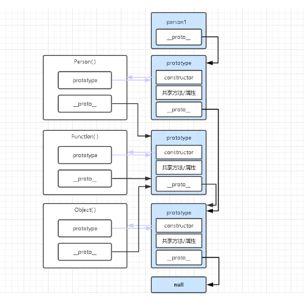

### 回顾原型

回顾原型图：




疑问：
1、 所有函数的__proto__指向他们的原型对象，即Function函数的prototype对象

函数即对象
```
function Person() {...}
console.log(Person.constructor) // 输出结果:[Function: Function]
// 上面是普通函数声明方法，生成具名函数，在声明时就已经生成对象模型。
console.log(Function.constructor) // 输出结果:[Function: Function]
console.log(Object.constructor) // 输出结果:[Function: Function]

```
2.最后一个prototype对象是Object函数内的prototype对象。

Object函数作为JS的内置对象，也是充当了很重要的角色。Object函数是所有对象通过原型链追溯到最根的构造函数。换句话说，就是官方动作，不讲道理的神仙操作

3.Object函数的prototype中的__proto__指向null。

这是由于Object函数的特殊性，有人会想，为什么Object函数不能像Function函数一样让__proto__
属性指向自己的prototype？答案就是如果指向自己的prototype，那当找不到某一属性时沿着原型链寻找的时候就会进入死循环，所以必须指向null，这个null其实就是个跳出条件。


上图原型链为：
忽略Function


### Function和Object鸡蛋问题

Object 构造函数继承了 Function.prototype，
同时 Function 构造函数继承了Object.prototype。
这里就产生了 鸡和蛋 的问题。为什么会出现这种问题，
因为 Function.prototype 和 Function.__ proto__ 都指向 Function.prototype。

1.Object instanceof Function
```

Object instanceof Function //true 

Function.prototype===Function.prototype
Function.__proto__===Function.prototype

Function.prototype..__proto__===Object.prototype
Function.__proto__.__proto__===Object.prototype


```

只要是函数，它的__proto__就指向 Funtion.prototype

Object也是函数。因此它的__proto__属性会指向Funtion.prototype。故而Object instanceof Function 为 true。


2.Function instanceof Object 

```

Function.prototype.__proto__===Object.prototype


```

### 参考

[Function & Object 鸡蛋问题](https://www.muyiy.cn/blog/5/5.3.html#引言)