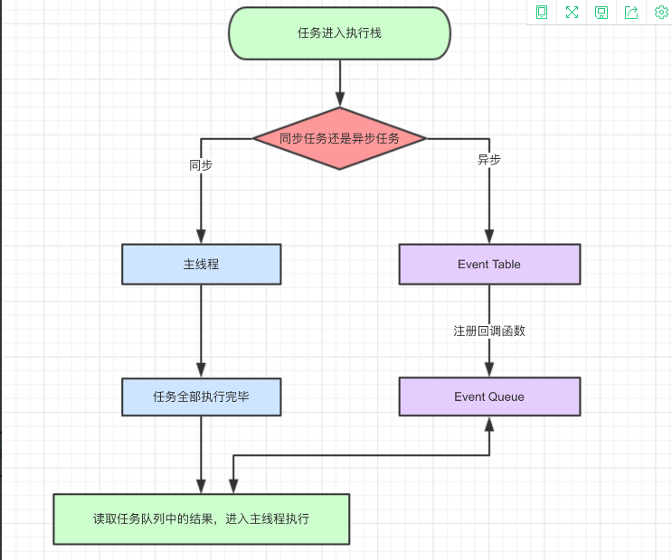
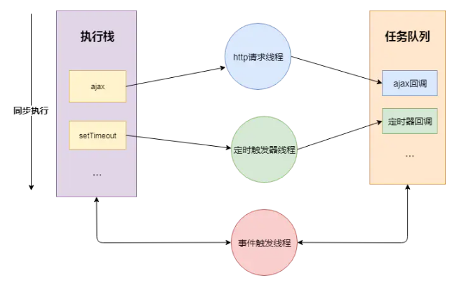

## 一、JavaScript 是单线程语言

我们知道JS是单线程的，JS是通过事件队列(Event Loop)的方式来实现异步回调的。
那为什么单线程的JS为什么拥有异步的能力

#### CPU

计算机的核心是CPU，他承担了计算的的所有计算任务


#### 进程

进程就好比工厂的车间，它代表CPU所能处理的单个任务。 进程之间相互独
立，任一时刻，CPU总是运行一个进程，其他进程处于非运行状态。 CPU使用
时间片轮转进度算法来实现同时运行多个进程。


#### 线程

一个车间里，可以有很多工人，共享车间所有的资源，他们协同完成一个任务。

线程就好比车间里的工人，一个进程可以包括多个线程，多个线程共享进程资源。


#### CPU、进程、线程之间的关系

* 进程是cpu资源分配的最小单位（是能拥有资源和独立运行的最小单位）
* 线程是cpu调度的最小单位（线程是建立在进程的基础上的一次程序运行单位，一个进程中可以有多个线程）
* 不同进程之间也可以通信，不过代价较大
* 单线程与多线程，都是指在一个进程内的单和多

以 Chrome 浏览器中为例，当你打开一个 Tab 页时，其实就是创建了一个进程，一个进程中可以有多个线程
（下文会详细介绍），比如渲染线程、JS 引擎线程、HTTP 请求线程等等。当你发起一个请求时，其实就是创
建了一个线程，当请求结束后，该线程可能就会被销毁。


### 浏览器是多进程的,每一个Tab页，就是一个独立的进程

* 主进程
  * 协调控制其他子进程（创建、销毁）
  * 浏览器界面显示，用户交互，前进、后退、收藏
  * 将渲染进程得到的内存中的Bitmap，绘制到用户界面上
  * 处理不可见操作，网络请求，文件访问等
* 第三方插件进程
  * 每种类型的插件对应一个进程，仅当使用该插件时才创建
* GPU进程
  * 用于3D绘制等
* 渲染进程，就是我们说的浏览器内核
  * 负责页面渲染，脚本执行，事件处理等
  * 每个tab页一个渲染进程
  
### 浏览器内核（渲染进程）

而对于渲染进程来说，它当然也是多线程的了，接下来我们来看一下渲染进程包含哪些线程。

* GUI渲染线程
  * 主要负责页面的渲染，解析 HTML、CSS，构建 DOM 树，布局和绘制等。
  * 页面需要重绘和回流时，该线程就会执行
  * 该线程与 JS 引擎线程互斥，当执行 JS 引擎线程时，GUI 渲染会被挂起，当任务队列空闲时，JS 引擎才会去执行 GUI 渲染。
* JS引擎线程
  * 负责处理解析和执行javascript脚本程序
  * 也是主要负责执行准备好待执行的事件，即定时器计数结束，或者异步请求成功并正确返回时，将依次进入任务队列，等待 JS 引擎线程的执行。
  * 当然，该线程与 GUI 渲染线程互斥，当 JS 引擎线程执行 JavaScript 脚本时间过长，将导致页面渲染的阻塞。
* 事件触发线程
  * 用来控制事件循环（鼠标点击、setTimeout、ajax等）
  * 当事件满足触发条件时，将事件放入到JS引擎所在的执行队列中
* 定时触发器线程
  * setInterval与setTimeout所在的线程
  * 定时任务并不是由JS引擎计时的，是由定时触发线程来计时的
  * 计时完毕后，通知事件触发线程
* 异步http请求线程
  * 负责执行异步请求一类的函数的线程，如： Promise，axios，ajax 等。
  * 当请求完成时，若有回调函数，通知事件触发线程
  
### 解答
为什么 javascript 是单线程的?
```
首先是历史原因，在创建 javascript 这门语言时，多进程多线程的架构并不流行，硬件支持并不好。
其次是因为多线程的复杂性，多线程操作需要加锁，编码的复杂性会增高。
而且，如果同时操作 DOM ，在多线程不加锁的情况下，最终会导致 DOM 渲染的结果不可预期。
```

为什么 GUI 渲染线程与 JS 引擎线程互斥?
```
这是由于 JS 是可以操作 DOM 的，如果同时修改元素属性并同时渲染界面(即 JS线程和UI线程同时运行)，
那么渲染线程前后获得的元素就可能不一致了。
因此，为了防止渲染出现不可预期的结果，浏览器设定 GUI渲染线程和JS引擎线程为互斥关系，
当JS引擎线程执行时GUI渲染线程会被挂起，GUI更新则会被保存在一个队列中等待JS引擎线程空闲时立即被执行

```

## 二、浏览器中的Event Loop
JavaScript Engine 和 JavaScript Runtime
简单来说，为了让 JavaScript 运行起来，要完成两部分工作（当然实际比这复杂的多）：

* 编译并执行 JavaScript 代码，完成内存分配、垃圾回收等；
* 为 JavaScript 提供一些对象或机制，使它能够与外界交互。

在 JavaScript 运行的时候，JavaScript Engine 会创建和维护相应的堆（Heap）和栈（Stack），
同时通过 JavaScript Runtime 提供的一系列 API（例如 setTimeout、XMLHttpRequest 等）来完成各种各样的任务。

JavaScript 是一种单线程的编程语言，只有一个调用栈，决定了它在同一时间只能做一件事情。

### 什么是 Event Loop
* JS 分为同步任务和异步任务
* 同步任务都在JS引擎线程上执行，形成一个执行栈
* 事件触发线程管理一个任务队列，异步任务触发条件达成，将回调事件放到任务队列中
* 执行栈中所有同步任务执行完毕，此时JS引擎线程空闲，系统会读取任务队列，将可运行的异步任务回调事件添加到执行栈中，开始执行
* 如此循环


怎么知道主线程执行栈为空啊？js引擎存在monitoring process进程，会持续不断的检查主线程执行栈是否为空，一旦为空，
就会去Event Queue那里检查是否有等待被调用的函数。

例：

当代码执行到setTimeout/setInterval时，实际上是JS引擎线程通知定时触发器线程，间隔一个时间后，会触发一个回调事件，
而定时触发器线程在接收到这个消息后，会在等待的时间后，将回调事件放入到由事件触发线程所管理的事件队列中。


当代码执行到XHR/fetch时，实际上是JS引擎线程通知异步http请求线程，发送一个网络请求，并制定请求完成后的回调事件，
而异步http请求线程在接收到这个消息后，会在请求成功后，将回调事件放入到由事件触发线程所管理的事件队列中。



```
let timerCallback = function() {
  console.log('wait one second');
};
let httpCallback = function() {
  console.log('get server data success');
}

// 同步任务
console.log('hello');
// 同步任务
// 通知定时器线程 1s 后将 timerCallback 交由事件触发线程处理
// 1s 后事件触发线程将 timerCallback 加入到事件队列中
setTimeout(timerCallback,1000);
// 同步任务
// 通知异步http请求线程发送网络请求，请求成功后将 httpCallback 交由事件触发线程处理
// 请求成功后事件触发线程将 httpCallback 加入到事件队列中
$.get('www.xxxx.com',httpCallback);
// 同步任务
console.log('world');
//...
// 所有同步任务执行完后
// 询问事件触发线程在事件事件队列中是否有需要执行的回调函数
// 如果没有，一直询问，直到有为止
// 如果有，将回调事件加入执行栈中，开始执行回调代码

```

### 微任务、宏任务
事件循环中的异步队列有两种：macro（宏任务）队列和 micro（微任务）队列。宏任务队列可以有多个，微任务队列只有一个。

* 常见的 macro-task 比如：setTimeout、setInterval、 setImmediate、script（整体代码）、 I/O 操作、UI 渲染等。
* 常见的 micro-task 比如: process.nextTick、new Promise().then(回调)、MutationObserver(html5 新特性) 等。

不同类型的任务会进入对应的Event Queue，比如setTimeout和setInterval会进入相同的Event Queue。

事件循环的顺序，决定js代码的执行顺序。进入整体代码(宏任务)后，开始第一次循环。接着执行所有的微任务。然后再次从宏任务
开始，找到其中一个任务队列执行完毕，再执行所有的微任务。

总结：
* 执行一个宏任务（栈中没有就从事件队列中获取）
* 执行过程中如果遇到微任务，就将它添加到微任务的任务队列中
* 宏任务执行完毕后，立即执行当前微任务队列中的所有微任务（依次执行）
* 当前宏任务执行完毕，开始检查渲染，然后GUI线程接管渲染
* 渲染完毕后，JS线程继续接管，开始下一个宏任务（从事件队列中获取）


## 三、Node环境中Event Loop
```
   ┌───────────────────────────┐
┌─>│           timers          │
│  └─────────────┬─────────────┘
│  ┌─────────────┴─────────────┐
│  │     pending callbacks     │
│  └─────────────┬─────────────┘
│  ┌─────────────┴─────────────┐
│  │       idle, prepare       │
│  └─────────────┬─────────────┘      ┌───────────────┐
│  ┌─────────────┴─────────────┐      │   incoming:   │
│  │           poll            │<─────┤  connections, │
│  └─────────────┬─────────────┘      │   data, etc.  │
│  ┌─────────────┴─────────────┐      └───────────────┘
│  │           check           │
│  └─────────────┬─────────────┘
│  ┌─────────────┴─────────────┐
└──┤      close callbacks      │
   └───────────────────────────┘

```
* timers：执行setTimeout() 和 setInterval()中到期的callback。
* pending callback: 上一轮循环中有少数的I/O callback会被延迟到这一轮的这一阶段执行
* idle, prepare：仅内部使用
* poll: 最为重要的阶段，执行I/O callback，在适当的条件下会阻塞在这个阶段
* check: 执行setImmediate的callback
* close callbacks: 执行close事件的callback，例如socket.on('close'[,fn])、http.server.on('close, fn)


## 四、区别

浏览器和 Node 环境下，microtask 任务队列的执行时机不同

* Node 端，microtask 微任务 在事件循环的各个阶段之间执行
* 浏览器端，microtask 微任务 在事件循环的 macrotask 宏任务执行完之后执行

### 参考
* [从多线程到Event Loop全面梳理](https://juejin.cn/post/6844903919789801486)
* [这一次，彻底弄懂 JavaScript 执行机制](https://juejin.cn/post/6844903512845860872)
* [一次弄懂Event Loop](https://juejin.cn/post/6844903764202094606)
* [浏览器与Node的事件循环(Event Loop)有何区别?](https://zhuanlan.zhihu.com/p/54882306)
* [彻底吃透 JavaScript 执行机制](https://juejin.cn/post/6844903955286196237)
