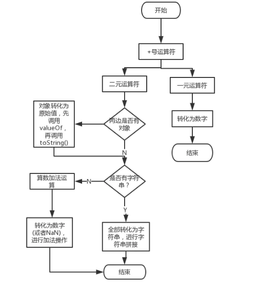

### 概念
将值从一种类型转换为另一种类型通常称为类型转换。

ES6 前，JavaScript 共有六种数据类型：Undefined、Null、Boolean、Number、String、Object。

类型转换主要有：
* 原始值到原始值转换
* 原始值到对象转换
* 对象到原始值转换
* +号运算符转换
* ==运算符转换

### 1.原始值到原始值转换
* 原始值转化为布尔值
* 原始值转数字
* 原始值转字符

#### 1.1 原始值转化为布尔值

我们使用 Boolean 函数将类型转换成布尔类型，在 JavaScript 中，只有 6 种值可以被转换成 false，其他都会被转换成 true。

```
console.log(Boolean()) // false

console.log(Boolean(false)) // false

console.log(Boolean(undefined)) // false
console.log(Boolean(null)) // false
console.log(Boolean(+0)) // false
console.log(Boolean(-0)) // false
console.log(Boolean(NaN)) // false
console.log(Boolean("")) // false

```
#### 1.2 原始值转数字

我们可以使用 Number 函数将类型转换成数字类型，如果参数无法被转换为数字，则返回 NaN。

根据规范，如果 Number 函数不传参数，返回 +0，如果有参数，调用 ToNumber(value)。

* 布尔转数字：true -> 1, false -> 0
* Undefined -> NaN
* Null -> +0
* Number -> 返回与之相等的值
* String(比较复杂)
  * 以数字表示的字符串可以直接会转为数字
  * 以数字表示的字符串有空格会忽略，但是空格在中间，转换结果就是 NaN
  * 空字符串转为0，000开头的数字字符串会被省略0取有效的数值
  * 其他进制的会被转为有效的十进制数字
```
console.log(Number()) // +0

console.log(Number(undefined)) // NaN
console.log(Number(null)) // +0

console.log(Number(false)) // +0
console.log(Number(true)) // 1

console.log(Number("123")) // 123
console.log(Number("-123")) // -123
console.log(Number("1.2")) // 1.2
console.log(Number("000123")) // 123
console.log(Number("-000123")) // -123

console.log(Number("0x11")) // 17

console.log(Number("")) // 0
console.log(Number(" ")) // 0

console.log(Number("123 123")) // NaN
console.log(Number("foo")) // NaN
console.log(Number("100a")) // NaN

onsole.log(parseInt("3 abc")) // 3
console.log(parseFloat("3.14 abc")) // 3.14
console.log(parseInt("-12.34")) // -12
console.log(parseInt("0xFF")) // 255
console.log(parseFloat(".1")) // 0.1
console.log(parseInt("0.1")) // 0

console.log(Number(1.1.1))//报错

```
#### 1.3 原始值转字符串
如果 String 函数不传参数，返回空字符串，如果有参数，调用 ToString(value)，而 ToString 也给了一个对应的结果表。表如下：


* Undefined	=>"undefined"
* Null	=>"null"
* Boolean	=>"true" /  "false"
* String	=>返回与之相等的值
* Number	=>比较复杂
```
console.log(String()) // 空字符串

console.log(String(undefined)) // undefined
console.log(String(null)) // null

console.log(String(false)) // false
console.log(String(true)) // true

console.log(String(0)) // 0
console.log(String(-0)) // 0
console.log(String(NaN)) // NaN
console.log(String(Infinity)) // Infinity
console.log(String(-Infinity)) // -Infinity
console.log(String(1)) // 1
```
### 2.原始值到对象转换
* null 和 undefined 转对象直接抛异常
* 原始值通过调用 String()、Number()、Boolean()构造函数，转换为他们各自的包装对象
```
var a = 1;
console.log(typeof a); // number
var b = new Number(a);
console.log(typeof b); // object

```
### 3.对象到原始值转换
* 对象转布尔值
* 对象转字符串
* 对象转数字

#### 3.1对象转布尔值
对象到布尔值的转换非常简单：所有对象(包括数组和函数)都转换为 true。
包括包装对象也都转换为true

```
var obj={};
var obj2=new Boolean(false);

console.log(Boolean(obj),Boolean(obj2)) 
//true,true
```

### 3.2 对象转字符串
对象到字符串和对象到数字的转换都是通过调用待转换对象的一个方法来完成的。
而 JavaScript 对象有两个不同的方法来执行转换，一个是 toString，一个是 valueOf。注意这个跟上面所说的 ToString 和 ToNumber 是不同的，这两个方法是真实暴露出来的方法。

分三步检测转换：
* 如果对象有 toString() 方法，就调用 toString() 方法。如果该方法返回原始值，就讲这个值转化为字符串。
* 如果对象没有 toString() 方法或者 该方法返回的不是原始值，就会调用该对象的 valueOf() 方法。如果存在就调用这个方法，如果返回值是原始值，就转化为字符串。
* 否则就报错

1.当调用对象的 toString 方法时，其实调用的是 Object.prototype 上的 toString 方法。

特列：对象转为[object Object] (其他儿子对象都是继承了Object.prototype.toString并重写
，所以得到不同结果)
* 数组的 toString 方法将每个数组元素转换成一个字符串，并在元素之间添加逗号后合并成结果字符串。
* 函数的 toString 方法返回源代码字符串。
* 日期的 toString 方法返回一个可读的日期和时间字符串。
* RegExp 的 toString 方法返回一个表示正则表达式直接量的字符串。

```
console.log(({}).toString()) // [object Object]

console.log([].toString()) // ""
console.log([0].toString()) // 0
console.log([1, 2, 3].toString()) // 1,2,3
console.log((function(){var a = 1;}).toString()) // function (){var a = 1;}
console.log((/\d+/g).toString()) // /\d+/g
console.log((new Date(2020, 11, 22)).toString()) // Tue Dec 22 2020 00:00:00 GMT+0800 (中国标准时间)

```
2.valueOf，表示对象的原始值。默认的 valueOf 方法返回这个对象本身，数组、函数、正则简单的继承了这个默认方法，也会返回对象本身。日期是一个例外，它会返回它的一个内容表示: 1970 年 1 月 1 日以来的毫秒数。

特例：Date转为数字
```
console.log(({}).valueOf(),typeof ({}).valueOf() ) //{} "object"

console.log([].valueOf(),typeof [].valueOf()) // [] "object"
console.log([0].valueOf(),Array.isArray([0].valueOf())) // [0]  true
console.log([1, 2, 3].valueOf()) // [1, 2, 3]
console.log((function(){var a = 1;}).valueOf())  //ƒ (){var a = 1;}
console.log((/\d+/g).valueOf()) // /\d+/g
console.log((new Date(2020, 11, 22)).valueOf()) //1608566400000
```


### 3.3 对象转数字

* 如果对象有 valueOf() 方法，就调用 valueOf() 方法。如果该方法返回原始值，就讲这个值转化为数字。
* 如果对象没有 valueOf() 方法或者 该方法返回的不是原始值，就会调用该对象的 toString() 方法。如果存在就调用这个方法，如果返回值是原始值，就转化为数字。
* 否则就报错


### 3.4 ToPrimitive
```
ToPrimitive(input[, PreferredType])
```

第一个参数是 input，表示要处理的输入值。

第二个参数是 PreferredType，非必填，表示希望转换成的类型，有两个值可以选，Number 或者 String。

当不传入 PreferredType 时，如果 input 是日期类型，相当于传入 String，否则，都相当于传入 Number。

如果传入的 input 是 Undefined、Null、Boolean、Number、String 类型，直接返回该值。

如果是 ToPrimitive(obj, Number)，处理步骤如下：

    1. 如果 obj 为 基本类型，直接返回
    2. 否则，调用 valueOf 方法，如果返回一个原始值，则 JavaScript 将其返回。
    3. 否则，调用 toString 方法，如果返回一个原始值，则 JavaScript 将其返回。
    4. 否则，JavaScript 抛出一个类型错误异常。
    
如果是 ToPrimitive(obj, String)，处理步骤如下：
    
    1. 如果 obj为 基本类型，直接返回
    2.否则，调用 toString 方法，如果返回一个原始值，则 JavaScript 将其返回。
    3.否则，调用 valueOf 方法，如果返回一个原始值，则 JavaScript 将其返回。
    4.否则，JavaScript 抛出一个类型错误异常。
    
### 3.5 JSON.stringify

值得一提的是：JSON.stringify() 方法可以将一个 JavaScript 值转换为一个 JSON 字符串，实现上也是调用了 toString 方法，也算是一种类型转换的方法。下面讲一讲JSON.stringify 的注意要点：

1. 处理基本类型时，与使用toString基本相同，结果都是字符串，除了 undefined
```
console.log(JSON.stringify(null)) // null
console.log(JSON.stringify(undefined)) // undefined，注意这个undefined不是字符串的undefined
console.log(JSON.stringify(true)) // true
console.log(JSON.stringify(42)) // 42
console.log(JSON.stringify("42")) // "42"
```

2. 布尔值、数字、字符串的包装对象在序列化过程中会自动转换成对应的原始值。
```
JSON.stringify([new Number(1), new String("false"), new Boolean(false)]); // "[1,"false",false]"

```

3. undefined、任意的函数以及 symbol 值，在序列化过程中会被忽略（出现在非数组对象的属性值中时）或者被转换成 null（出现在数组中时）。
```
JSON.stringify({x: undefined, y: Object, z: Symbol("")}); 
// "{}"

JSON.stringify([undefined, Object, Symbol("")]);          
// "[null,null,null]" 
//拓展：深浅拷贝

```

4.JSON.stringify 有第二个参数 replacer，它可以是数组或者函数，用来指定对象序列化过程中哪些属性应该被处理，哪些应该被排除。

```
function replacer(key, value) {
  if (typeof value === "string") {
    return undefined;
  }
  return value;
}

var foo = {foundation: "Mozilla", model: "box", week: 45, transport: "car", month: 7};
var jsonString = JSON.stringify(foo, replacer);

console.log(jsonString)
// {"week":45,"month":7}
var foo = {foundation: "Mozilla", model: "box", week: 45, transport: "car", month: 7};
console.log(JSON.stringify(foo, ['week', 'month']));
// {"week":45,"month":7}


```

5. 如果一个被序列化的对象拥有 toJSON 方法，那么该 toJSON 方法就会覆盖该对象默认的序列化行为：不是那个对象被序列化，而是调用 toJSON 方法后的返回值会被序列化，例如：

```
var obj = {
  foo: 'foo',
  toJSON: function () {
    return 'bar';
  }
};
JSON.stringify(obj);      // '"bar"'
JSON.stringify({x: obj}); // '{"x":"bar"}'

```


### 4. + 运算符

#### 4.1 +作为一元运算符

当 + 运算符作为一元操作符的时候，查看 ES5规范1.4.6，会调用 ToNumber 处理该值
+ +原始类型
```
console.log(+'1');  //1
console.log(+'');   //0
console.log(+1);   //1
console.log(+false); //0
console.log(+true);  //1
console.log(+'1.1');  //1.1
console.log(+'1.1.1.1'); //NaN
console.log(+'0x12');   //18
console.log(+0x12);   //18

```

* +obj

```
console.log(+[]);             //0
console.log(+['1']);          //1
console.log(+['1', '2', '3']); //NaN
console.log(+{});              //NaN

console.log([].valueOf(),[].valueOf().toString(),+[]);
console.log(['1'].valueOf(),['1'].valueOf().toString(),+['1']);
console.log(['1', '2', '3'].valueOf (),['1', '2', '3'].valueOf ().toString(),+['1', '2', '3']);
console.log({}.valueOf (),{}.valueOf ().toString(),+{});


// [] "" 0
// ["1"] "1" 1
//  ["1", "2", "3"] "1,2,3" NaN
// {} "[object Object]" NaN

```
流程：
* 如果 obj 为基本类型，直接返回
* 否则，调用 valueOf 方法，如果返回一个原始值，则 JavaScript 将其返回。
* 否则，调用 toString 方法，如果返回一个原始值，则JavaScript 将其返回。
* 否则，JavaScript 抛出一个类型错误异常。


####  4.2 +作为二元运算符



1. 先看两边有对象，对象转为原始值
  * 调用valueOf 方法，如果返回一个原始值，则 JavaScript 将其返回
  * 调用 toString 方法，如果返回一个原始值，则JavaScript 将其返回。
2. 再看两边(转换后)是否有字符串，如果有字符串，全部转为字符串，进行字符串拼接
3. 如果没有字符串，转为数字或者NaN进行数字计算

```
console.log([]+[]); //1. "" []->[].valueOf() []->[].toString()->""

console.log({}+[]);//2. {}->{}.valueOf() {}->{}.toString()->[object][object]

console.log(new Date(2017, 04, 21) + 1) // 3. "Sun May 21 2017 00:00:00 GMT+0800 (CST)1"
//同样的问题还出现在 {} + {} 上，而且火狐和谷歌的结果还不一样：

//> {} + {}
// 火狐： NaN
// 谷歌： "[object Object][object Object]"


```

### 5.==转换

参考规范，具体步骤可以查看规范11.9.5

当执行x==y
1. 如果x与y是同一类型：
      * x是Undefined，返回true
      * x是Null，返回true
      * x是数字
         * x或者y为NaN(包括NaN==NaN)，返回false
         * x与y相等，返回true
         * +0==-0;-0==+0;返回true
         * 其他返回false
      * x是字符串，完全相等返回true,否则返回false
      * x是布尔值，x和y都是true或者false，返回true，否则返回false
      * x和y指向同一个对象，返回true，否则返回false
  
2. null == undefined
3.x是字符串，y是数字，判断ToNumber(x) == y
4. x是数字，y是字符串，判断x == ToNumber(y)
5. x是布尔值，判断ToNumber(x) == y
6. y是布尔值，判断x ==ToNumber(y)
7. x 不是字符串或者数字，y是对象，判断x == ToPrimitive(y)
8. x是对象，y不是字符串或者数字，判断ToPrimitive(x) == y
9.返回false


简化：

1. null == undefined

2. 数字和字符串
   * 数字和字符串对比，字符串转为数字 ，然后比较

3. 布尔值和其他类型
   * 先将布尔值ToNumber转为数字
4. 对象和非对象
   * 对象->valueOf->toString
   
   
### 6. 其他
if、? :、&& 也会引起隐式转换

* +'1' 转数字类型
* ''+1 转字符串类型
* !!  转Boolean
